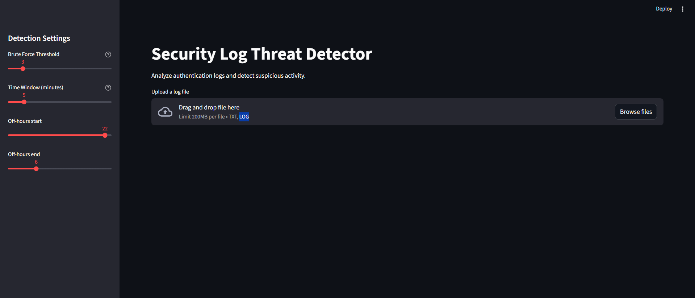

# Security Log Threat Detector

A lightweight cybersecurity tool that analyzes authentication logs and detects suspicious login activity such as brute force attacks and off-hours access.

The project demonstrates how security teams can automate log analysis to quickly identify potential threats in large volumes of authentication data.

---

## Features

* Detects **brute force login attempts**
* Identifies **logins outside normal working hours**
* Interactive **web dashboard** using Streamlit
* Upload and analyze custom log files
* Alert visualization with charts and metrics
* Export alerts to **CSV**
* Log security alerts for further investigation

---

## Dashboard

Example interface:



The dashboard allows analysts to:

* Upload authentication logs
* Adjust detection thresholds
* View detected threats
* Export alerts for further analysis

---

## Project Structure

```
security-log-threat-detector
│
├── src
│   ├── main.py
│   ├── log_parser.py
│   ├── rule_engine.py
│   └── alerts.py
│
├── data
│   └── sample_auth.log
│
├── logs
│   └── .gitkeep
│
├── docs
│   └── dashboard.png
│
├── streamlit_app.py
├── requirements.txt
├── .gitignore
└── README.md
```

---

## Detection Capabilities

### Brute Force Detection

Flags accounts that exceed a configurable number of failed login attempts within a short time window.

Example:

```
user=john failed login 3 times within 5 minutes
```

---

### Off-Hours Login Detection

Detects logins occurring outside defined working hours (e.g. 22:00-06:00).

This can highlight:

* compromised accounts
* suspicious administrator access
* automated scripts

---

## Example Log Format

```
2026-03-10 10:01:21 user=john ip=192.168.1.5 status=failure
2026-03-10 10:01:40 user=john ip=192.168.1.5 status=failure
2026-03-10 10:02:02 user=john ip=192.168.1.5 status=failure
2026-03-10 23:30:15 user=admin ip=10.0.0.8 status=success
```

---

## Installation

Clone the repository:

```
git clone https://github.com/YOUR_USERNAME/security-log-threat-detector.git
cd security-log-threat-detector
```

Install dependencies:

```
pip install -r requirements.txt
```

---

## Running the Dashboard

Start the Streamlit interface:

```
streamlit run streamlit_app.py
```

Your browser will open automatically.

Upload a log file to begin analysis.

---

## Example Output

Detected alerts include:

* username
* IP address
* timestamp
* alert type
* detection rule triggered

Alerts can be exported to:

```
logs/alerts.csv
logs/security_alerts.log
```

---

## Skills Demonstrated

This project demonstrates practical cybersecurity and software engineering skills including:

* Log parsing and analysis
* Threat detection logic
* Security monitoring automation
* Python backend development
* Data visualization
* Dashboard creation with Streamlit
* Modular code architecture

---

## Future Improvements

Potential enhancements include:

* additional detection rules (credential stuffing, IP reputation)
* integration with threat intelligence feeds
* REST API for automated log ingestion
* real-time log monitoring
* Docker container deployment

